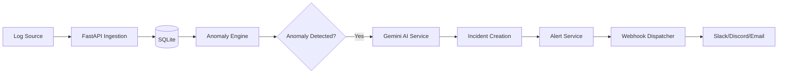

# System Architecture

Watchdog is designed as a modular observability platform that bridges the gap between raw log ingestion and actionable AI-driven intelligence.

## Component Responsibilities

### 1. Frontend (React 18)
- **UI/UX**: Implements an Apple-inspired design system with glassmorphism.
- **State Management**: Uses TanStack Query for server-state synchronization and caching.
- **Visualization**: Leverages Recharts for real-time error rate trends and severity distributions.

### 2. Backend (FastAPI)
- **API Layer**: Provides RESTful endpoints for logs, incidents, and system health.
- **Ingestion Engine**: Handles multi-format file uploads and background processing.
- **Anomaly Engine**: Orchestrates multiple detectors (ML and Rule-based).
- **AI Service**: Integrates with Google Gemini for log summarization and RCA.

### 3. Storage Layer
- **Relational DB**: SQLite stores users, logs, incidents, and webhook history.
- **File Storage**: Simulated email outputs and log datasets.

## Data Flow



1. **Ingestion**: Logs are uploaded via API or generated synthetically.
2. **Parsing**: Background tasks normalize different formats into a unified schema.
3. **Detection**: The `AnomalyEngine` runs Isolation Forest (ML) and Z-Score analysis.
4. **Analysis**: Gemini 2.5 Flash analyzes the log context of the anomaly.
5. **Alerting**: Incidents trigger alerts which are dispatched via the `WebhookService`.

## Database ER Diagram (ASCII)

```text
+----------------+       +------------------+       +-------------------+
|     User       |       |      LogEntry    |       |     Incident      |
+----------------+       +------------------+       +-------------------+
| id (PK)        |       | id (PK)          |       | id (PK)           |
| email          |       | timestamp        |       | title             |
| hashed_password|       | service_name     |       | incident_type     |
| role           |       | level            |       | status            |
+----------------+       | message          |       | severity          |
                         | metadata_json    |       | log_sample (JSON) |
                         +------------------+       | ai_analysis       |
                                                    +-------------------+
                                                              |
                                                              v
+----------------+       +------------------+       +-------------------+
|     Alert      |       |  WebhookHistory  |       |   WebhookHistory  |
+----------------+       +------------------+       +-------------------+
| id (PK)        |       | id (PK)          |       | id (PK)           |
| incident_id(FK)|<------| alert_id (FK)    |       | status            |
| status         |       | target_type      |       | attempt_count     |
+----------------+       | status           |       +-------------------+
```

## Sequence Diagram: Incident Creation

```text
LogSource -> API: Upload Logs
API -> BackgroundTask: Process File
BackgroundTask -> DB: Insert Normalized Logs
AnomalyEngine -> DB: Query Recent Logs
AnomalyEngine -> AnomalyEngine: Run Isolation Forest
AnomalyEngine -> Gemini: Analyze Anomalous Logs
Gemini -> AnomalyEngine: Return Root Cause Analysis
AnomalyEngine -> DB: Create Incident (with AI analysis)
AnomalyEngine -> AlertService: Trigger Alert
AlertService -> WebhookService: Dispatch to Slack/Discord
```
